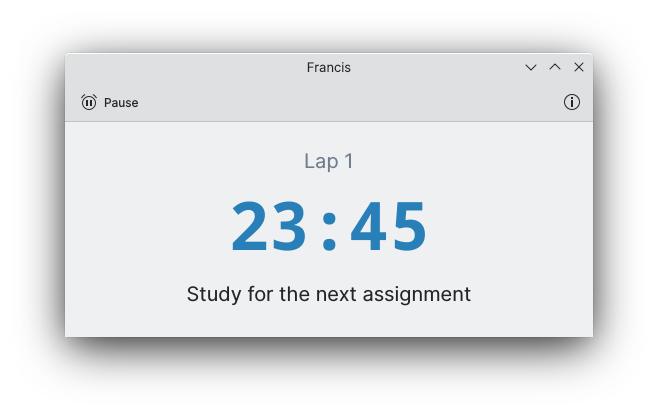

<!--
    SPDX-FileCopyrightText: 2022 Felipe Kinoshita <kinofhek@gmail.com>
    SPDX-License-Identifier: CC0-1.0
-->

# Francis


Track your time.



Francis uses the well-known pomodoro technique to help you get more productive.

## Build Flatpak

To build and install a flatpak bundle of Francis use the following instructions:

```bash
$ git clone https://invent.kde.org/utilities/francis.git
$ cd francis

$ flatpak remote-add --user --if-not-exists flathub https://flathub.org/repo/flathub.flatpakrepo
$ flatpak-builder --user --install-deps-from=flathub --force-clean --ccache --install build org.kde.francis.json
```
