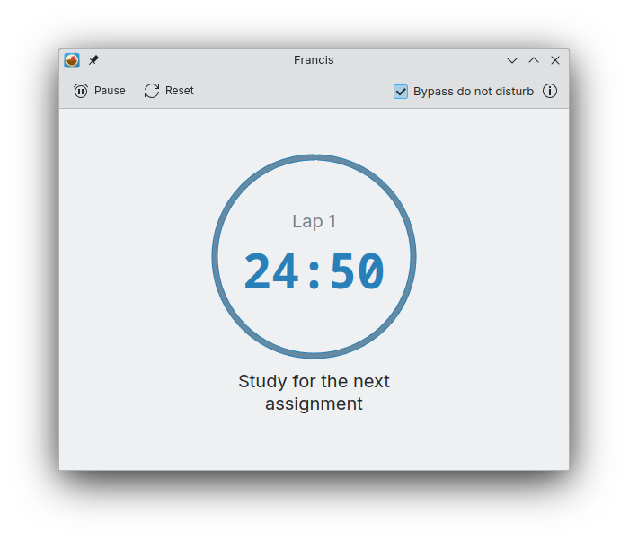

<!--
    SPDX-FileCopyrightText: 2022 Felipe Kinoshita <kinofhek@gmail.com>
    SPDX-License-Identifier: CC0-1.0
-->

# Francis

Track your time.



Francis uses the well-known pomodoro technique to help you get more productive.

## Build Flatpak

To build a flatpak bundle of Francis use the following instructions:

```bash
$ git clone https://invent.kde.org/fhek/francis.git
$ cd francis
$ flatpak-builder --repo=repo build-dir --force-clean org.kde.francis.json
$ flatpak build-bundle repo francis.flatpak org.kde.francis
```

Now you can either double-click the `francis.flatpak` file to open it with
some app store (discover, gnome-software, etc...) or run:

```bash
$ flatpak install francis.flatpak
```
